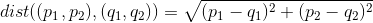

# Python og Pita workshop
- [Link til slides](https://bit.ly/2MDHOdR)
- Kode eksempler ligger i `eksempler` mappen

## Installation af Python 3
- **Windows:** https://realpython.com/installing-python/#windows
- **MacOS:** https://realpython.com/installing-python/#macos-mac-os-x
- **Linux:** https://realpython.com/installing-python/#linux

## Del 1 - Opgaver
### Opgave 1.
Lav en funktion, der udregner den euklidiske afstand mellem to punkter `p` og `q`. Punkterne  representeres som en tuple af `x` og `y` koordinaterne og afstanden kan udregnes vha. følgende formel:


**Skabelon**
```python
from math import sqrt

def distance(p, q):
	pass

print(distance((2,1),(4,1)))    # Output: 2.0
print(distance((4,3),(3,20)))   # Output: 17.029...
print(distance((14,10),(0,11))) # Output: 14.036...
print(distance((13,18),(12,8))) # Output: 10.049...
```


### Opgave 2.
TODO (Tupler)

### Opgave 3.
TODO (Flere return værdier)

### Opgave 4.
TODO (Keyword arguments)

## Del 2 - Opgaver
### Opgave 1.
Lav en funktion, som tjekker hvorvidt en liste `lst` er sorteret. 

**Skabelon**
```python
def is_sorted(lst):
	pass


print(is_sorted([17, 23, 27, 19, 31, 11])) # Output: False
print(is_sorted([1, 24, 26, 30, 33]))      # Output: True
print(is_sorted([9, 30, 39, 43, 43, 44]))  # Output: True
print(is_sorted([18, 14, 16, 5, 25]))      # Output: False
```

### Opgave 2.
Lav en klasse som representerer en person. Den skal kunne printe en person med navn `name` og alder `age`, som `name (age years old)`. Derudover skal det være mulig at sammenligne to personer på deres alder, det vil altså sige at for to personer `person1` og `person2` skal det være muligt at tjekke hvorvidt `person1` er ældre en `person2` på følgende måde `person1 > person2`

**Skabelon:**
```python
class Person:
	pass

person1 = Person("Alice", 17)
person2 = Person("Bob", 19)
person3 = Person("Charles", 24)

print(person1)           # Output: "Alice (17 years old)"
print(person2)           # Output: "Bob (19 years old)"
print(person2)           # Output: "Charles (24 years old)"
print(person1 > person3) # Output: False
print(person2 > person1) # Output: True
```

### Opgave 3.
Lav en funktion, som tjekker hvorvidt et given tal `n` er et primtal. Det kan gøres ved at alle løbe talene fra 2 til sqrt(n) og tjekke hvorvidt tallet går op i `n`

**Skabelon:**
```python
from math import sqrt

def is_prime(n):
	pass

print(is_prime(7))  # Output: True
print(is_prime(16)) # Output: False
print(is_prime(23)) # Output: True
print(is_prime(42)) # Output: False
```

### Opgave 4
Lav en funktion som laver bineær søgning over en liste og et element. Det vil sige en funktion `binary_search` som tager en liste `lst` og et element `elm` og retunerer et index `i` hvor `lst[i] == elm` 
	
**Skabelon:**
```python
def binary_search(lst, elm):
	pass

print(binary_search([12, 13, 18, 28, 31, 33, 35, 37, 45, 47], 45))     # Output: 8
print(binary_search([0, 2, 8, 12, 16, 17, 29, 32, 37, 39], 12))        # Output: 3
print(binary_search([4, 14, 17, 23, 24, 29, 32, 35, 42], 4))           # Output: 0
print(binary_search([3, 5, 12, 29, 31, 37], 31))                       # Output: 4
```

## Brugbare biblioteker
- https://docs.python.org/3/library/math.html
- http://mypy-lang.org/
- https://www.sympy.org/en/index.html
- https://docs.scipy.org/doc/numpy/reference/
- https://matplotlib.org/contents.html
- https://ipython.readthedocs.io/en/stable/

